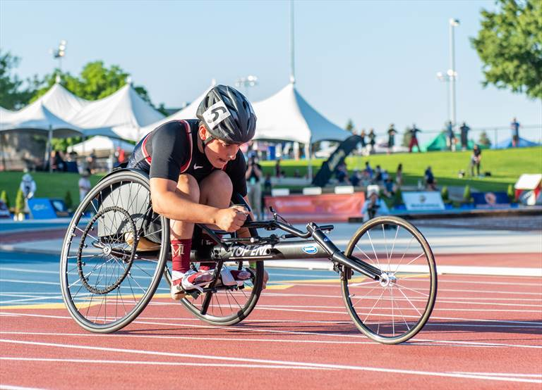

# i-chair

## iChair

### Introduction

[https://github.com/vietphan1995/i-chair.git](https://github.com/vietphan1995/i-chair.git)

iChair is a wheel chair research to product project, this chair keeps traditional physical wheel chair and has advance functions to deal with complexity terrain and traffic, in self balancing, energy saving …

Especially in terrain exchange, iChair has stand leg to bring it and driver to new terrain, like variety stairs, steps, public transition vehicle ground exchange like train/bus/ship, … 

### [back to git projects …](https://github.com/vietphan1995/projects)

### Notes
https://phantrungviet.notion.site/i-chair-1f15e832d6ee80dda530e4c4fa46c64b